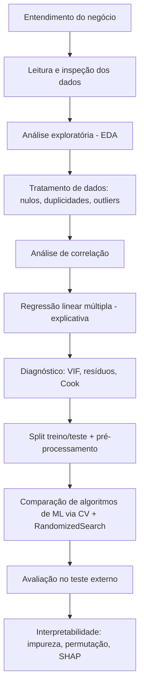

# 📊 Estudo de Caso: Métodos de Projeção — Potencial de Gasto de Novos Clientes

> **Material de apoio didático** — Pós-Graduação e MBA em Analytics, Inteligência Artificial e Data Science
> Este repositório documenta, passo a passo, o raciocínio por trás de um projeto completo de **regressão** aplicado a um problema real de negócio: estimar quanto um novo cliente irá gastar no cartão private label de uma rede de lojas de departamento.

> ⚠️ **Aviso importante**: este material **não é um gabarito para ser copiado**. O objetivo é ensinar a pensar como um cientista de dados profissional pensa: entender o problema, questionar os dados, justificar cada decisão técnica e comunicar resultados de forma clara. Uma solução de referência (nota máxima em uma turma anterior) foi usada como base de **fluxo de trabalho**, mas todo o texto foi reescrito com foco didático.

---

## 📑 Sumário

1. [Introdução ao estudo de caso](#-introdução-ao-estudo-de-caso)
2. [Objetivo do projeto](#-objetivo-do-projeto)
3. [Problema de negócio](#-problema-de-negócio)
4. [Bibliotecas utilizadas](#-bibliotecas-utilizadas)
5. [Estrutura do projeto](#-estrutura-do-projeto)
6. [Conhecendo os dados](#-conhecendo-os-dados)
7. [Fluxo completo do projeto](#-fluxo-completo-do-projeto)
   - [Análise exploratória dos dados (EDA)](#1️⃣-análise-exploratória-dos-dados-eda)
   - [Tratamento e limpeza dos dados](#2️⃣-tratamento-e-limpeza-dos-dados)
   - [Análise de correlação](#3️⃣-análise-de-correlação)
   - [Separação entre treino e teste](#4️⃣-separação-entre-treino-e-teste)
   - [Construção do modelo de Regressão Linear](#5️⃣-construção-do-modelo-de-regressão-linear)
   - [Da regressão clássica ao machine learning: comparando algoritmos](#6️⃣-da-regressão-clássica-ao-machine-learning-comparando-algoritmos)
   - [Avaliação do modelo](#7️⃣-avaliação-do-modelo)
   - [Interpretabilidade: importância de variáveis](#8️⃣-interpretabilidade-importância-de-variáveis)
8. [Interpretação das métricas](#-interpretação-das-métricas)
9. [Principais conclusões](#-principais-conclusões)
10. [Possíveis melhorias para versões futuras](#-possíveis-melhorias-para-versões-futuras)
11. [Boas práticas utilizadas no projeto](#-boas-práticas-utilizadas-no-projeto)
12. [Aprendizados que o aluno pode extrair deste estudo](#-aprendizados-que-o-aluno-pode-extrair-deste-estudo)

---

## 🧭 Introdução ao estudo de caso

Toda empresa que emite um cartão de crédito próprio (o chamado **private label**) enfrenta uma pergunta estratégica logo nos primeiros meses de relacionamento com o cliente: *"esse cliente vai gerar receita relevante no futuro, ou seu engajamento inicial é passageiro?"*

Neste estudo de caso, uma rede de lojas de departamento forneceu uma base com o comportamento de consumo de clientes nos **3 primeiros meses** de posse do cartão (quantidade de transações, valor gasto, perfil demográfico, satisfação, etc.) e o valor efetivamente gasto nos **12 meses seguintes**. A tarefa do cientista de dados é usar esse "retrato inicial" do cliente para **projetar** o gasto futuro.

Esse é um exemplo clássico de problema de **regressão supervisionada**: temos uma variável numérica contínua que queremos prever (o gasto futuro) a partir de variáveis explicativas conhecidas no presente.

> 💡 **Por que isso importa na prática?**
> Esse tipo de modelo não fica "engavetado" depois de pronto — ele alimenta decisões reais: definição de limite de crédito, priorização de campanhas de ativação, segmentação de carteira e até dimensionamento de equipes de relacionamento. Um erro de projeção grande custa dinheiro: crédito mal dimensionado, campanhas mal direcionadas.

---

## 🎯 Objetivo do projeto

Desenvolver um **fluxo completo de modelagem preditiva**, cobrindo:

- Entendimento do problema de negócio antes de tocar em qualquer linha de código;
- Análise exploratória e estatística dos dados;
- Construção de um modelo de regressão linear múltipla clássico (inferencial, via `statsmodels`), usado para **explicar** relações;
- Construção e comparação de modelos de **machine learning** (via `scikit-learn`), usados para **prever** com a melhor precisão possível;
- Avaliação criteriosa de desempenho e de interpretabilidade (SHAP, importância por permutação, etc.).

> 📌 **Diferença conceitual importante**: regressão linear clássica (com testes de hipótese e p-valores) e modelos de machine learning para predição servem propósitos diferentes. O primeiro grupo prioriza **explicabilidade estatística** (quais variáveis importam e como). O segundo prioriza **acurácia preditiva**, mesmo que o modelo seja uma "caixa-preta" (por isso, depois, usamos SHAP para abri-la). Um bom projeto de Analytics sabe transitar entre os dois mundos.

---

## 💼 Problema de negócio

| Pergunta de negócio | Tradução em Data Science |
|---|---|
| Quanto um cliente vai gastar no cartão nos próximos 12 meses? | Prever uma variável numérica contínua (`VALOR_GASTO_PROX_12M`) → **problema de regressão** |
| Quais comportamentos iniciais indicam maior potencial de consumo? | Interpretar coeficientes/importância de variáveis explicativas |
| Como usar isso para ação (crédito, campanhas)? | Modelo deve ser preciso **e** interpretável, não só uma "caixa preta" |

A motivação de negócio é dupla: **direcionar melhor o investimento em aquisição/ativação de clientes** (evitando gastar recursos em quem tem baixo potencial) e **calibrar limites de crédito iniciais** de forma mais assertiva, reduzindo tanto o risco de inadimplência (limite alto demais para quem não vai usar) quanto a perda de receita (limite baixo demais para quem gastaria mais).

---

## 📚 Bibliotecas utilizadas

| Categoria | Bibliotecas | Para que servem |
|---|---|---|
| Manipulação de dados | `pandas`, `numpy` | Leitura, limpeza e transformação da base |
| Visualização | `matplotlib`, `seaborn` | Gráficos de análise exploratória e de resíduos |
| Estatística / regressão clássica | `statsmodels` | Ajuste do modelo OLS, testes de significância, VIF |
| Pré-processamento | `scikit-learn` (`ColumnTransformer`, `OneHotEncoder`, `StandardScaler`) | Codificação de variáveis qualitativas e padronização de escalas |
| Modelagem preditiva | `scikit-learn` (`Ridge`, `Lasso`, `ElasticNet`, árvores, `RandomForest`, `GradientBoosting`, `AdaBoost`), `xgboost`, `lightgbm` | Comparação de algoritmos de regressão |
| Busca de hiperparâmetros | `scikit-learn` (`RandomizedSearchCV`, `KFold`) | Otimização e validação cruzada |
| Interpretabilidade | `shap`, `sklearn.inspection.permutation_importance` | Explicar o "porquê" das previsões do modelo final |
| Utilitários | `time`, `scipy.stats` (`loguniform`, `randint`) | Controle de tempo de execução e distribuições para busca aleatória |

> 🧠 **Dica**: perceba que **duas famílias de bibliotecas** convivem no projeto: `statsmodels` (mundo estatístico/inferencial, com testes de hipótese) e `scikit-learn` (mundo de machine learning, focado em performance preditiva). Saber quando usar cada uma é uma marca de maturidade técnica.

---

## 🗂 Estrutura do projeto

```
📦 estudo-caso-projecao
 ┣ 📜 README.md                                  → este guia
 ┣ 📜 Potencial_Novos_Clientes.txt                → base de dados bruta (separada por tabulação)
 ┣ 📓 estudo_caso_projecao.ipynb                  → notebook com o desenvolvimento completo
 ┗ 📄 enunciado.pdf                               → enunciado original do estudo de caso
```

> 🔧 **Boa prática**: mantenha o notebook organizado em **seções nomeadas** (com células Markdown antes de cada bloco de código), na mesma ordem lógica das perguntas de negócio. Isso facilita tanto a correção/revisão quanto a reutilização do notebook como template para outros projetos.

---

## 🔍 Conhecendo os dados

O arquivo `Potencial_Novos_Clientes.txt` está na **visão cartão/cliente**: cada linha representa um cliente único (um cliente só pode ter um cartão). São **2.930 registros e 11 colunas**, sem nenhum valor ausente (`isna().sum()` retorna zero em todas as colunas) — o que já é uma informação valiosa obtida logo na primeira inspeção.

### Dicionário de variáveis

| Variável | Tipo | Descrição | Papel no modelo |
|---|---|---|---|
| `COD_CARTAO` | Identificador | Código único do cartão/cliente | Não é preditora (identificador, deve ser excluído do modelo) |
| `IDADE_CLIENTE` | Quantitativa | Idade do cliente, em anos | Explicativa |
| `RENDA_MENSAL_CLIENTE` | Quantitativa | Renda mensal declarada, em R$ | Explicativa |
| `BEHAVIOUR_SCORE_CLIENTE` | Quantitativa | Score comportamental (crédito/consumo) | Explicativa |
| `QTD_TRANSACOES_3M` | Quantitativa (contagem) | Nº de transações nos 3 primeiros meses | Explicativa |
| `QTD_ITENS_3M` | Quantitativa (contagem) | Nº de itens comprados nos 3 primeiros meses | Explicativa |
| `VALOR_GASTO_3M` | Quantitativa | Total gasto nos 3 primeiros meses, em R$ | Explicativa |
| `TICKET_MEDIO_3M` | Quantitativa | Valor médio por transação nos 3 primeiros meses | Explicativa |
| `FLAG_ALTO_CUSTO_3M` | Qualitativa binária (0/1) | Se houve compra em estabelecimento de alto custo | Explicativa (dummy) |
| `SATISFACAO_CARTAO` | Qualitativa (categórica, 6 níveis) | Nível de satisfação (pesquisa opcional) | Explicativa (dummies) |
| `VALOR_GASTO_PROX_12M` | Quantitativa | Total gasto nos 12 meses seguintes | **Variável resposta (y)** |

> ⚠️ **Ponto de atenção conceitual**: `SATISFACAO_CARTAO` inclui a categoria `Nao_Respondeu`, proveniente de uma pesquisa **não obrigatória**. Isso significa que "não respondeu" **não é a mesma coisa** que "valor ausente" — é uma categoria de resposta válida e deve ser tratada como tal (um nível a mais da variável categórica), e não como algo a ser imputado ou removido. Confundir esses dois conceitos é um erro comum de quem está começando.

> 💡 **Curiosidade**: separar as variáveis explicativas em duas listas — uma de quantitativas e outra de qualitativas — logo no início do projeto (como `lista_X_quanti` e `lista_X_quali`) é uma prática simples, mas poderosa. Ela é reaproveitada em praticamente todas as etapas seguintes (gráficos, dummies, padronização), evitando repetição de código e reduzindo o risco de esquecer alguma variável.

---

## 🔄 Fluxo completo do projeto

O fluxo lógico do projeto segue a sequência natural de qualquer projeto sério de modelagem preditiva: **entender → limpar → explorar → modelar (para explicar) → modelar (para prever) → validar → interpretar**.



### 1️⃣ Análise exploratória dos dados (EDA)

**O que é feito:** antes de qualquer modelo, olhamos a relação **bivariada** entre cada variável explicativa e a variável resposta.

- Para variáveis **qualitativas** (`FLAG_ALTO_CUSTO_3M`, `SATISFACAO_CARTAO`): **boxplots** comparando a distribuição do gasto futuro entre categorias.
- Para variáveis **quantitativas**: **gráficos de dispersão** (scatterplots) contra a variável resposta.

**Por que essa etapa é importante:** a EDA é o momento em que formamos hipóteses de negócio *antes* de rodar qualquer modelo. Ela também revela padrões que o modelo, sozinho, pode "esconder" atrás de um coeficiente — por exemplo, relações não lineares ou heterocedasticidade (dispersão que aumenta conforme o valor da variável cresce).

**O que aconteceria se fosse ignorada:** o analista corre o risco de aceitar cegamente os resultados do modelo sem entender *se* eles fazem sentido, e de não perceber problemas de qualidade de dados (outliers extremos, categorias raras, relações não lineares) antes de eles contaminarem a modelagem.

> ❌ **Erro comum de iniciante**: usar o mesmo tipo de gráfico para tudo (por exemplo, scatterplot para variáveis categóricas). O tipo de gráfico deve respeitar a natureza da variável: **boxplot/violino para categóricas**, **dispersão para quantitativas**, e **heatmap de correlação** para pares de quantitativas.

> ✅ **Boa prática observada no projeto de referência**: gerar os gráficos em **grade automática** (usando `plt.subplots` com `ncols`/`nrows` calculados dinamicamente a partir do tamanho da lista de variáveis), em vez de copiar e colar um bloco de código para cada variável. Isso é mais escalável e menos propenso a erros de copy-paste.

Interpretando os resultados obtidos na base: clientes que fizeram ao menos uma compra "de alto custo" nos 3 primeiros meses (`FLAG_ALTO_CUSTO_3M = 1`) tendem a apresentar gasto futuro mediano mais alto — um indício inicial (a ser confirmado estatisticamente) de que esse comportamento sinaliza maior potencial de consumo.

---

### 2️⃣ Tratamento e limpeza dos dados

#### Tratamento de valores ausentes
A base analisada **não apresenta valores ausentes** em nenhuma coluna (verificado com `dados.isna().sum()`). Ainda assim, essa checagem **deve sempre ser feita explicitamente e documentada** — mesmo quando o resultado é "zero problemas". Nunca assuma que uma base está limpa sem verificar.

> 💡 Caso houvesse valores ausentes, as estratégias mais comuns seriam: exclusão de linhas (quando o volume de ausentes é pequeno e aleatório), imputação por média/mediana/moda, ou modelos de imputação mais sofisticados (KNN, regressão). A escolha depende do **mecanismo de ausência** (é aleatório? está relacionado a outra variável?) e do impacto no tamanho da amostra.

#### Tratamento de duplicidades
Como cada `COD_CARTAO` representa um cliente único, o passo natural é verificar duplicidade de identificador (`dados['COD_CARTAO'].duplicated().sum()`). Registros duplicados nesse contexto poderiam indicar erro de carga de dados (ex.: o mesmo cliente aparecendo duas vezes) e distorceriam qualquer estimativa estatística, já que duplicar uma observação equivale a "dar peso dobrado" para aquele cliente no modelo.

> ❌ **Erro comum de iniciante**: verificar duplicidade apenas com `dados.duplicated().sum()` considerando **todas as colunas**. Isso pode não pegar duplicidades reais de negócio (o mesmo cliente com pequenas variações de valores por erro de sistema). O ideal é sempre verificar duplicidade também **pela chave de negócio** (aqui, `COD_CARTAO`).

#### Tratamento de outliers
O enunciado não pede tratamento de outliers como etapa isolada, mas o tema aparece de forma **transversal** ao longo do projeto: nos gráficos de dispersão da EDA, no histograma e QQ-plot de resíduos, e principalmente nas **distâncias de Cook** (ver seção de diagnóstico do modelo, abaixo).

> 📌 **Ponto de reflexão**: nem todo outlier deve ser removido. Em um problema de gasto de clientes, um valor muito alto pode representar um cliente legítimo de altíssimo potencial — remover esse ponto poderia **jogar fora justamente a informação mais valiosa para o negócio** (identificar clientes de alto valor). A decisão de remover ou manter um outlier deve ser guiada por conhecimento de negócio, não apenas por um critério estatístico automático.

---

### 3️⃣ Análise de correlação

**O que é feito:** cálculo da matriz de correlação linear de Pearson entre todas as variáveis quantitativas (incluindo a resposta), visualizada com um **heatmap**.

**Por que é importante:** a correlação de Pearson mede a força e a direção da relação **linear** entre pares de variáveis. Ela cumpre dois papéis no projeto:

1. Dar um primeiro sinal de **quais variáveis devem ser fortes preditoras** no modelo de regressão;
2. Alertar sobre **multicolinearidade** — quando duas variáveis explicativas são fortemente correlacionadas entre si, o que pode distorcer a interpretação dos coeficientes do modelo (mais detalhes na seção de VIF).

Na base analisada, `QTD_TRANSACOES_3M` (correlação de aproximadamente 0,89) e `VALOR_GASTO_3M` (aproximadamente 0,70) são as variáveis mais correlacionadas com o gasto futuro — resultado coerente com a lógica de negócio: clientes mais engajados/transacionais no início tendem a manter esse padrão de consumo.

> 🧠 **Dica conceitual**: correlação **não implica causalidade**, e correlação de Pearson só captura relações **lineares** — duas variáveis podem ter uma relação forte, porém não linear (por exemplo, em forma de "U"), e o coeficiente de Pearson pode indicar (erroneamente) que não há associação relevante. Por isso, o heatmap deve sempre ser interpretado **em conjunto** com os gráficos de dispersão da EDA, nunca isoladamente.

> ❌ **Erro comum de iniciante**: olhar apenas para a correlação da variável resposta com cada preditora e ignorar a correlação **entre preditoras** — que é justamente o que origina problemas de colinearidade no modelo.

---

### 4️⃣ Separação entre treino e teste

**O que é feito:** a base é dividida em **75% treino / 25% teste externo**, com semente aleatória fixa (`random_state=123`) para garantir reprodutibilidade.

**Por que é importante:** um modelo deve ser avaliado em dados que ele **nunca viu durante o treinamento**. Se avaliarmos o desempenho apenas nos dados de treino, corremos alto risco de **overfitting** — o modelo "decorou" os dados de treino, mas terá desempenho ruim em clientes novos, que é justamente o cenário real de uso.

**Pré-processamento (aplicado *depois* do split, e não antes!):**
- Variáveis **quantitativas** → padronização via **z-score** (`StandardScaler`): coloca todas as variáveis na mesma escala (média 0, desvio-padrão 1), evitando que variáveis com magnitudes maiores (ex.: renda, em milhares de reais) dominem artificialmente variáveis com escalas menores (ex.: idade, em dezenas).
- Variáveis **qualitativas** → **one-hot encoding** com `drop='first'`: transforma categorias em colunas binárias (0/1), pois a maioria dos algoritmos não interpreta texto/categorias diretamente. O `drop='first'` remove uma categoria de referência para evitar redundância perfeita entre as colunas (armadilha da variável dummy / *dummy variable trap*).

> ⚠️ **Erro crítico e muito comum**: aplicar `fit_transform` no `StandardScaler`/`OneHotEncoder` na base **inteira antes de separar treino e teste**. Isso causa **vazamento de dados (data leakage)**: estatísticas do conjunto de teste (médias, desvios, categorias) "vazam" para o treinamento, inflando artificialmente o desempenho do modelo em avaliação, mas quebrando a promessa de que o teste representa dados nunca vistos. A ordem correta é sempre: **1) separar treino/teste → 2) ajustar (`fit`) o pré-processamento apenas no treino → 3) aplicar (`transform`) o mesmo objeto ajustado no teste.**

---

### 5️⃣ Construção do modelo de Regressão Linear

Aqui o projeto trabalha em **duas frentes complementares**, cada uma com um propósito diferente.

#### 5.1 Regressão linear múltipla clássica (inferencial)

**O que é feito:** ajuste de um modelo `OLS` (Mínimos Quadrados Ordinários) via `statsmodels`, usando **todas** as variáveis explicativas (após codificação one-hot das qualitativas), com seleção de variáveis via **stepwise backward manual**, a um nível de significância de 3%.

**Como funciona o stepwise backward:**
1. Ajusta-se o modelo com todas as variáveis explicativas;
2. Identifica-se a variável com o **maior p-valor acima do limiar de significância** (aqui, 3%);
3. Remove-se essa variável e reajusta-se o modelo;
4. Repete-se o processo até que todas as variáveis remanescentes sejam estatisticamente significativas.

No estudo de caso, esse processo removeu sequencialmente `QTD_ITENS_3M`, uma categoria de satisfação e outra categoria de satisfação, chegando a um modelo final em que todas as variáveis remanescentes têm p-valor ≤ 0,03 e o modelo explica cerca de **85,7% da variância** do gasto futuro (R² ajustado).

> 📌 **Por que fazer isso "na mão" e não de forma automática (ex.: `RFE`, `stepwise` de alguma biblioteca)?** Fazer manualmente força o analista a **olhar o resumo do modelo a cada iteração**, entendendo o impacto de cada remoção nos coeficientes, no R² e na significância das demais variáveis — algo que um processo totalmente automatizado esconderia. É uma etapa pedagógica tanto quanto técnica.

**Interpretando coeficientes:** cada coeficiente estimado representa a variação esperada em `VALOR_GASTO_PROX_12M` para um aumento de uma unidade na variável correspondente, **mantendo as demais variáveis constantes** (efeito *ceteris paribus*). O intercepto representa o valor esperado da resposta quando todas as variáveis explicativas quantitativas são zero e as variáveis qualitativas estão na categoria de referência — uma interpretação que, na prática, muitas vezes não corresponde a um cliente real (por exemplo, "idade zero" não existe), mas que é matematicamente necessária ao modelo.

> ❌ **Erro comum de iniciante**: interpretar o coeficiente de uma variável **sem mencionar a condição "mantendo as demais constantes"**, ou interpretar magnitude de coeficientes de variáveis em escalas muito diferentes como se fossem diretamente comparáveis (uma variável em R$ terá coeficiente numericamente muito diferente de uma variável em anos, mesmo que a segunda seja mais "importante").

#### 5.2 Diagnóstico de colinearidade (VIF)

**O que é feito:** cálculo do **Fator de Inflação da Variância (VIF)** para cada variável do modelo final do stepwise.

**Por que importa:** o VIF mede o quanto a variância de um coeficiente estimado é "inflada" por causa de correlação com as demais variáveis explicativas. VIFs altos (o projeto de referência adota um critério conservador, marcando como preocupante valores próximos ou acima de 2) indicam colinearidade, o que pode tornar os coeficientes **instáveis e de interpretação arriscada**, mesmo que o modelo, como um todo, continue tendo boa capacidade preditiva.

No estudo de caso, `QTD_TRANSACOES_3M`, `VALOR_GASTO_3M`, `TICKET_MEDIO_3M` e `BEHAVIOUR_SCORE_CLIENTE` apresentam os maiores VIFs — resultado que faz sentido de negócio, já que essas variáveis descrevem, de formas distintas, a **mesma dimensão subjacente**: o quanto o cliente já está engajado no cartão.

> 💡 **Observação importante do enunciado**: mesmo detectando colinearidade, o exercício pede explicitamente para **não** reajustar o modelo removendo variáveis nesse momento. Isso é proposital: o objetivo pedagógico é **primeiro aprender a diagnosticar** o problema, para só depois (em projetos futuros ou em versões avançadas) decidir como tratá-lo (ex.: remover uma das variáveis correlacionadas, usar regularização como Ridge, ou combinar variáveis via PCA).

#### 5.3 Diagnóstico de resíduos

**O que é feito:** histograma dos resíduos, QQ-plot, gráfico de resíduos versus valores preditos, gráfico de valores observados versus preditos, e cálculo das **distâncias de Cook**.

**Premissas verificadas:**
- **Normalidade dos resíduos** (histograma + QQ-plot): no caso analisado, observou-se leve assimetria e afastamento da normalidade nas caudas, sugerindo presença de valores atípicos.
- **Homocedasticidade** (variância constante dos resíduos): avaliada no gráfico de resíduos vs. preditos — um "funil" (dispersão crescente) indicaria heterocedasticidade.
- **Pontos influentes**: a distância de Cook mede o quanto a **remoção de uma única observação** mudaria as estimativas do modelo. Usa-se comumente o limite de referência **4/n** para sinalizar pontos potencialmente influentes.

> 🧠 **Por que essas premissas importam?** A inferência estatística clássica (intervalos de confiança, testes de hipótese, p-valores) do modelo OLS depende dessas premissas para ser **teoricamente válida**. Quando elas são violadas, ainda podemos usar o modelo para prever, mas **devemos ser mais cautelosos ao interpretar p-valores e intervalos de confiança** como se fossem exatos.

> ❌ **Erro comum de iniciante**: olhar só o R² do modelo e ignorar completamente os gráficos de resíduos. Um R² alto não garante que as premissas do modelo estão sendo respeitadas — é perfeitamente possível ter um R² bom e, ainda assim, um modelo mal especificado (por exemplo, ignorando uma relação não linear).

---

### 6️⃣ Da regressão clássica ao machine learning: comparando algoritmos

Depois de explorar a regressão linear clássica (foco explicativo), o projeto avança para uma comparação sistemática de **algoritmos de machine learning** (foco preditivo), incluindo:

- **Regressão linear regularizada**: Ridge, Lasso e ElasticNet — variações da regressão linear que adicionam uma penalização aos coeficientes, o que ajuda a **lidar com colinearidade** e reduzir overfitting;
- **Árvore de regressão** (única árvore de decisão);
- **Floresta aleatória** (Random Forest — conjunto de árvores treinadas em subamostras);
- **Algoritmos de boosting**: AdaBoost, Gradient Boosting, Histogram-based Gradient Boosting, XGBoost e LightGBM — modelos que constroem árvores sequencialmente, cada uma corrigindo os erros da anterior.

**Metodologia de comparação:**
- **Validação cruzada com k = 10 folds**, garantindo que a avaliação de cada combinação de hiperparâmetros não dependa de uma única divisão dos dados;
- **Busca aleatória de hiperparâmetros** (`RandomizedSearchCV`, 50 iterações por algoritmo): em vez de testar exaustivamente todas as combinações possíveis (grid search, que cresce exponencialmente), sorteia-se um número fixo de combinações dentro de intervalos definidos — uma estratégia mais eficiente quando o espaço de hiperparâmetros é grande;
- Semente aleatória fixa (**123**) em todos os pontos relevantes (algoritmos, k-fold, busca aleatória), exceto no Ridge (que, sendo uma solução fechada/determinística nesse contexto, não depende de aleatoriedade) — mais uma vez, para **garantir reprodutibilidade**.

Para cada configuração testada, são armazenados o **erro médio de treino**, o **erro médio de teste interno** (validação cruzada) e o **erro no teste externo** — permitindo enxergar não só qual modelo é mais preciso, mas também **quão estável** ele é entre os diferentes conjuntos (um modelo com erro baixíssimo no treino mas muito mais alto no teste é um sinal claro de overfitting).

> 💡 **Por que comparar tantos algoritmos, em vez de já escolher "o melhor"?** Não existe um algoritmo universalmente superior para todo problema (princípio conhecido como *no free lunch*). A única forma responsável de escolher um modelo é **testar empiricamente**, no seu problema e nos seus dados específicos, e comparar de forma justa (mesma validação cruzada, mesmas métricas, mesma semente).

> ❌ **Erro comum de iniciante**: escolher o modelo com **menor erro de treino**. Esse critério tende a favorecer modelos complexos e propensos a overfitting. O critério correto é combinar **bom desempenho no teste (interno e externo)** com **baixa variação entre treino e teste** — ou seja, um modelo que generaliza bem, e não apenas um que "decora" os dados de treino.

No estudo de caso, o modelo final escolhido foi um **Gradient Boosting**, com hiperparâmetros otimizados via busca aleatória — selecionado por apresentar baixo erro no teste interno **e** boa estabilidade entre treino, teste interno e teste externo (e não simplesmente o menor erro isolado em um único conjunto).

---

### 7️⃣ Avaliação do modelo

No conjunto de **teste externo** (dados nunca usados em nenhuma etapa de treinamento ou de busca de hiperparâmetros), calculam-se quatro métricas complementares — ver interpretação detalhada na próxima seção — além de uma inspeção gráfica dos resíduos: histograma, resíduos versus preditos, e observado versus predito.

> 🧠 **Por que usar mais de uma métrica?** Cada métrica revela um aspecto diferente do erro. Usar apenas uma pode mascarar problemas — por exemplo, um R² alto não impede que o modelo erre muito em valores extremos (clientes de gasto muito alto ou muito baixo).

---

### 8️⃣ Interpretabilidade: importância de variáveis

Para o modelo final (baseado em árvores), a importância das variáveis é avaliada por **três métodos diferentes**, propositalmente, para checar se chegam a conclusões parecidas:

1. **Redução de impureza** (nativa de modelos baseados em árvore): mede o quanto cada variável contribuiu, em média, para reduzir o erro nas divisões (splits) das árvores. É rápida de calcular, mas pode favorecer variáveis com muitos valores distintos.
2. **Importância por permutação**: embaralha aleatoriamente os valores de uma variável (quebrando sua relação com a resposta) e mede o quanto o desempenho do modelo piora. É mais robusta e **agnóstica ao tipo de modelo**, mas mais custosa computacionalmente.
3. **Valores SHAP** (SHapley Additive exPlanations): baseados em teoria dos jogos, atribuem a cada variável uma contribuição individual e consistente para cada previsão, permitindo entender tanto a **magnitude** quanto a **direção** (positiva ou negativa) do efeito de cada variável.

No caso analisado, os três métodos convergem para as mesmas variáveis mais relevantes — `QTD_TRANSACOES_3M`, `VALOR_GASTO_3M`, `BEHAVIOUR_SCORE_CLIENTE`, `RENDA_MENSAL_CLIENTE` e `IDADE_CLIENTE` — reforçando a confiabilidade da conclusão. O gráfico *beeswarm* de SHAP mostra, adicionalmente, que valores mais altos dessas variáveis estão associados a um gasto futuro mais elevado, resultado coerente com a análise bivariada feita lá no início do projeto — fechando o ciclo entre exploração inicial e interpretação final do modelo.

> 💡 **Por que isso é tão valioso para o negócio?** Um modelo que "acerta, mas ninguém sabe por quê" tem baixa adoção prática em empresas — gestores de crédito e marketing precisam entender **o racional** por trás da pontuação de um cliente para confiar na decisão e, eventualmente, defendê-la (inclusive perante reguladores, no caso de crédito).

---

## 📐 Interpretação das métricas

| Métrica | O que mede | Como interpretar |
|---|---|---|
| **RMSE** (Raiz do Erro Quadrático Médio) | Erro médio de previsão, na mesma unidade da variável resposta (R$), penalizando mais fortemente erros grandes | Quanto menor, melhor. Sensível a outliers |
| **MAE** (Erro Absoluto Médio) | Erro médio absoluto, também em R$, mas sem penalizar desproporcionalmente erros grandes | Mais fácil de comunicar a públicos não técnicos ("o modelo erra, em média, R$ X") |
| **MAPE** (Erro Percentual Absoluto Médio) | Erro médio em termos percentuais em relação ao valor real | Cuidado: indefinido/instável quando há valores reais iguais ou próximos de zero (como ocorre nesta base, em que há clientes com `VALOR_GASTO_PROX_12M = 0`) |
| **R²** (Coeficiente de Determinação) | Proporção da variância da resposta explicada pelo modelo | Quanto mais próximo de 1, melhor o ajuste — mas nunca deve ser olhado isoladamente |

No teste externo do estudo de caso, o modelo final apresentou aproximadamente **RMSE ≈ R$ 617**, **MAE ≈ R$ 399** e **R² ≈ 0,88**, indicando boa capacidade explicativa. O **MAPE resultou em infinito**, um problema causado justamente pela divisão por valores reais iguais a zero (clientes que não gastaram nada nos 12 meses seguintes) — uma limitação conhecida dessa métrica, que deve ser mencionada explicitamente em qualquer relatório, e não simplesmente descartada sem explicação.

> 📌 **Dica prática**: quando o MAPE não é confiável (por causa de zeros ou valores muito próximos de zero na variável resposta), prefira reportar RMSE e MAE, ou calcule o MAPE apenas no subconjunto de clientes com gasto positivo, deixando essa escolha metodológica explícita no relatório.

---

## ✅ Principais conclusões

- Variáveis relacionadas ao **comportamento transacional inicial** (`QTD_TRANSACOES_3M`, `VALOR_GASTO_3M`) são, disparadamente, as mais relevantes para prever o gasto futuro — o que confirma, estatisticamente, a intuição de negócio de que "engajamento gera engajamento".
- O modelo de regressão linear clássica, mesmo com indícios de colinearidade e leve desvio de normalidade dos resíduos, ainda oferece um bom nível de explicação (R² ≈ 85,7%) e é valioso pela **interpretabilidade direta dos coeficientes**.
- Um modelo de **Gradient Boosting**, ajustado via validação cruzada e busca de hiperparâmetros, superou os demais algoritmos testados em termos de equilíbrio entre precisão e estabilidade entre treino/teste, sendo escolhido como modelo final para fins **preditivos**.
- Os três métodos de importância de variáveis (impureza, permutação e SHAP) convergem, o que aumenta a confiança nas conclusões de negócio — clientes mais transacionais, com maior renda, melhor score comportamental e mais velhos tendem a gastar mais no futuro.

---

## 🚀 Possíveis melhorias para versões futuras

- Tratar explicitamente a colinearidade identificada via VIF (por exemplo, removendo variáveis redundantes ou aplicando Ridge/PCA), avaliando o impacto na estabilidade dos coeficientes.
- Investigar transformações da variável resposta (ex.: `log(VALOR_GASTO_PROX_12M + 1)`) para tentar aproximar melhor os resíduos de uma distribuição normal e reduzir heterocedasticidade.
- Avaliar tratamento específico para clientes com `VALOR_GASTO_PROX_12M = 0` — talvez um modelo em duas etapas (classificação: "vai gastar ou não" + regressão: "quanto vai gastar, dado que gasta") capture melhor esse comportamento do que um único modelo de regressão.
- Testar engenharia de atributos adicionais, como razões entre variáveis (ex.: gasto por transação já existe como `TICKET_MEDIO_3M`, mas outras combinações podem ser exploradas).
- Validar a estabilidade do modelo ao longo do tempo (monitoramento/*drift*) caso venha a ser usado em produção, já que o comportamento de consumo pode mudar com sazonalidade ou condições econômicas.

---

## 🏆 Boas práticas utilizadas no projeto

- ✅ Separação clara entre variáveis quantitativas e qualitativas desde o início, reutilizada em todas as etapas.
- ✅ Pré-processamento ajustado **somente no treino** e aplicado (nunca reajustado) no teste externo — evitando vazamento de dados.
- ✅ Uso de **sementes aleatórias fixas** em todas as etapas com componente estocástico, garantindo reprodutibilidade.
- ✅ Validação cruzada + busca aleatória de hiperparâmetros, em vez de ajuste manual ou "tentativa e erro" sem critério.
- ✅ Comparação de **múltiplas famílias de algoritmos**, não apenas um único candidato.
- ✅ Escolha do modelo final baseada em **estabilidade** entre treino/teste, não apenas no menor erro absoluto.
- ✅ Uso de **múltiplos métodos de interpretabilidade** para checar convergência de conclusões, em vez de confiar cegamente em um único método.
- ✅ Interpretação de negócio conectada a cada resultado técnico — nenhum gráfico ou métrica fica "solto", sem explicação do que significa para a operação da empresa.

---

## 🎓 Aprendizados que o aluno pode extrair deste estudo

1. Um projeto de Analytics de qualidade começa **muito antes do código**: no entendimento do problema de negócio e das variáveis disponíveis.
2. Regressão linear clássica e machine learning **não competem** — são ferramentas complementares, uma voltada à explicação estatística, outra à performance preditiva.
3. Diagnóstico de premissas (normalidade, homocedasticidade, colinearidade, pontos influentes) não é uma formalidade acadêmica: ele diz o quanto podemos **confiar** nas interpretações do modelo.
4. Vazamento de dados é um dos erros mais silenciosos e mais graves em projetos de modelagem — a disciplina de sempre separar treino/teste antes de qualquer ajuste de pré-processamento deve virar hábito automático.
5. Escolher um modelo final é uma decisão que combina **critérios quantitativos** (erro, estabilidade) com **julgamento** (interpretabilidade, aplicabilidade no negócio) — não existe uma fórmula única e definitiva.
6. Interpretabilidade (SHAP, permutação, importância por impureza) é o que transforma um modelo preciso em um modelo **útil e confiável** para quem vai usar suas previsões no dia a dia da empresa.

---

> 📬 Dúvidas, sugestões de melhoria ou identificou algum ponto que merece aprofundamento? Sinta-se à vontade para abrir uma *issue* neste repositório — este material é vivo e deve evoluir junto com a turma.
